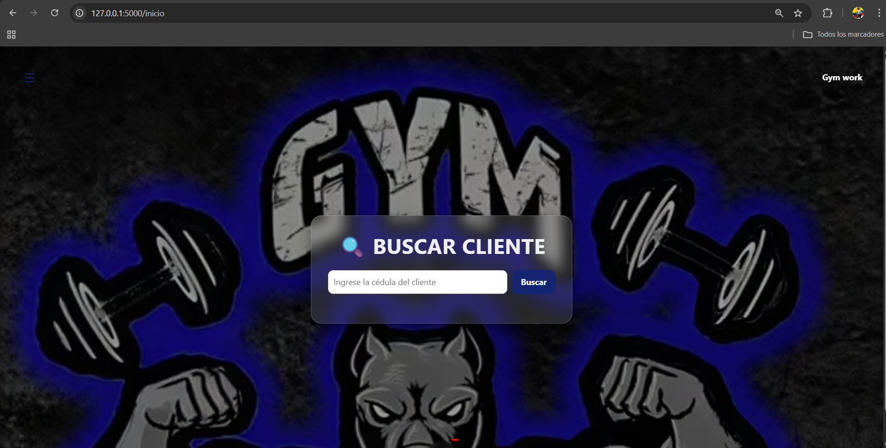
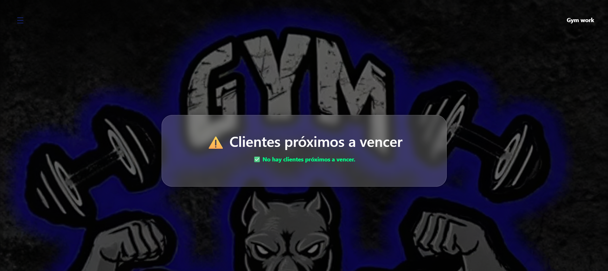
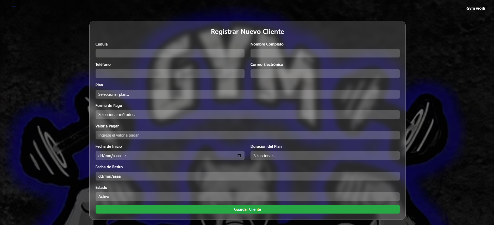
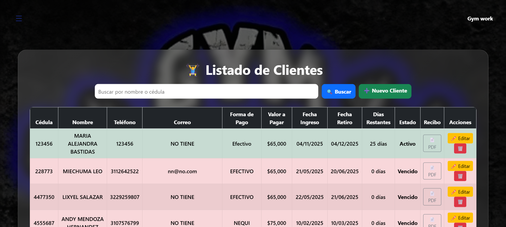
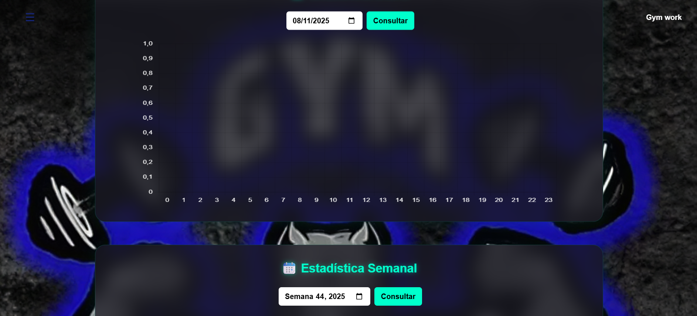

# Convenciones

- Captura de pantalla del inicio de nuestro menu 

- Captura de pantalla de proximos a vencer "esto sucede cuando al cliente le quedan 3 dias o menos"

- Captura de pantalla para agregar nuevo clientes 

- Captura de pantalla del listado de clientes 

- Captura de pantalla de las estadisticas 
