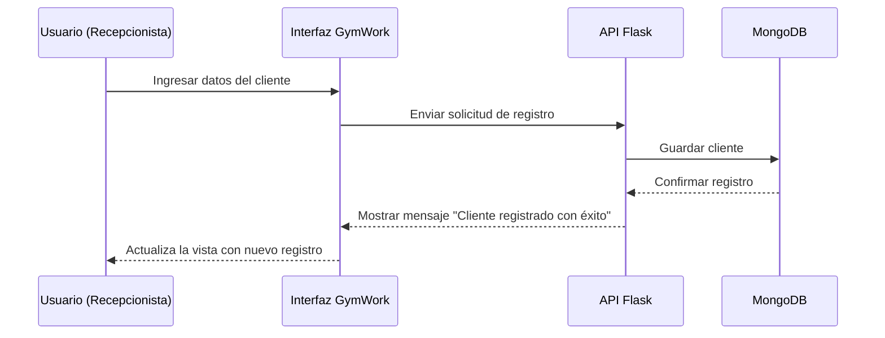

# 🎯 Objetivo

Guiar a los **usuarios finales del sistema GymWork** (administradores, recepcionistas y entrenadores) en el uso correcto y seguro de la aplicación, explicando paso a paso las principales funcionalidades de gestión de clientes, generación de recibos y control de membresías.

---

# 👥 Público objetivo

- **Recepcionistas:** encargados de registrar nuevos usuarios, generar recibos y verificar pagos.  
- **Administradores:** responsables de gestionar estadísticas, eliminar y modificar registros.  
  
- Nivel técnico requerido: **básico–medio**.

---

# ⚙️ Requisitos previos

- Acceso al sistema y credenciales válidas.  
- Navegador recomendado: **Google Chrome (v120 o superior)**.  
- Conexión a red local o Internet.  
- Conocimiento básico de atención al cliente y registro de datos.

---

# 🔐 Acceso y autenticación

1. Abre tu navegador y dirígete a la dirección del sistema GymWork: 
- http://127.0.0.1:5000/ 
2. Si el sistema tiene autenticación habilitada, ingresa tus credenciales asignadas por el administrador.  
3. Accede al panel principal donde podrás gestionar clientes, membresías y reportes.

# Navegación general

- Menú superior: acceso rápido a “Inicio”, “Renovar”, “Listar Clientes” y “Estadísticas”.

- Área principal: muestra formularios y resultados según el módulo seleccionado.

- Botones de acción: Guardar, Eliminar, Generar Recibo, Exportar PDF.

- Pie de página: créditos del sistema y versión actual.

# Funcionalidades del software

> Sustituye los ejemplos por tus funcionalidades reales. Mantén la estructura por módulo.

## Módulo 1 — Registro de Clientes

- Descripción: permite a la recepcionista registrar nuevos clientes del gimnasio.

- Prerrequisitos: tener datos del cliente (nombre, cédula, teléfono, plan, forma de pago).

- Pasos:
  1. `<En el menú principal, selecciona “Inicio”.>`
  2. `<Diligencia el formulario con los datos del cliente.>`
  3. `<Presiona “Registrar” para guardar en la base de datos.>`

- Mensajes comunes:

    - ✅ “Cliente registrado con éxito.”

    - ⚠️ “El cliente ya existe.”

    - ❌ “Faltan campos obligatorios.”

## Módulo 2 — Renovación de Membresía

- Descripción: actualizar el plan o los pagos de un cliente existente.

- Pasos:
  1. Selecciona “Renovar” en el menu.
  2. Ingresa la cédula del cliente.
  3. Verifica los datos y actualiza el plan o valor a pagar.
  4. Genera el recibo PDF con el botón correspondiente.

  - Archivos generados: se guardan automáticamente en la carpeta /recibos/.

## Módulo 3 — Listado de Clientes

- Descripción: muestra una tabla con todos los clientes registrados.

- Funciones disponibles:

    - Buscar por nombre o cédula.

    - Ordenar por fecha de ingreso o estado.

    - Eliminar o editar registros.
    
- Mensajes:

    - “Cliente eliminado con éxito.”

    - “Error al eliminar, intenta nuevamente.”

## Módulo 4 — Estadísticas

- Descripción: visualizar información general del gimnasio.

- Datos mostrados:

    - Total de clientes activos y vencidos.

    - Promedio de pagos.

    - Distribución por tipo de plan.

- Acciones disponibles:

    - Exportar reportes en formato PDF.

    - Actualizar datos en tiempo real.

# Ejemplos de uso

## Básico - Registrar un nuevo cliente

1. Ingresa a la pestaña Inicio.

2. Completa el formulario con los datos del cliente.

3. Haz clic en Registrar.

4. Se mostrará un mensaje de confirmación.

## Avanzado - Generar recibo PDF

1. En Renovar, busca al cliente.

2. Haz clic en Generar Recibo.

3. El archivo se guardará en la carpeta recibos/ con el nombre del cliente y la fecha..

# Accesibilidad y usabilidad

- Navegación con teclado (Tab, Enter).

- Diseño centrado y legible.

- Interfaz compatible con pantallas medianas y grandes.

- Colores suaves y contraste adecuado.

# Seguridad y privacidad

- No compartas credenciales de acceso.

- Los datos se almacenan localmente en MongoDB; no se comparten con terceros.

- Solo el administrador puede eliminar registros.

- Los recibos generados no deben ser modificados manualmente.

# Solución de problemas

| Problema                      | Causa probable                 | Solución                                       |
| ----------------------------- | ------------------------------ | ---------------------------------------------- |
| No puedo registrar un cliente | Faltan campos obligatorios     | Completa todos los datos antes de guardar.     |
| No se genera el PDF           | No existe la carpeta “recibos” | Crea la carpeta manualmente.                   |
| No se muestran estadísticas   | MongoDB no está activo         | Inicia MongoDB (`mongod`) y recarga la página. |
| Error de conexión             | La API Flask no se ejecuta     | Ejecuta `python app.py`.                       |

# Preguntas frecuentes (FAQ)

- ¿Puedo registrar clientes sin Internet?
Sí, mientras tengas MongoDB instalado localmente.

- ¿Cómo elimino un cliente?
Ingresa a “Listado” → selecciona el registro → presiona “Eliminar”.

- ¿Dónde se guardan los recibos generados?
En la carpeta /recibos/ dentro del directorio principal del sistema.

# Soporte

- Correo: jefersoncely0@gmail.com

- Horario de atención: Lunes a viernes, 8:00 a.m. – 6:00 p.m.

- Tiempo estimado de respuesta: 24 a 48 horas hábiles.

# Créditos

- Desarrollador: Jheferson Esney Cely Arango
- Proyecto: Sistema de Gestión de Gimnasio — GYMWORK
- Versión: 1.0
- Fecha: noviembre de 2025