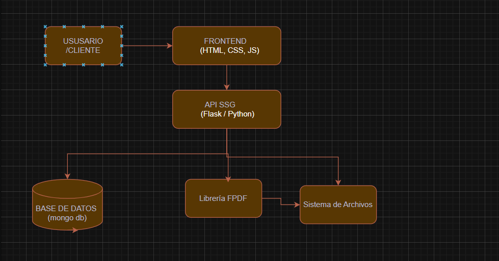
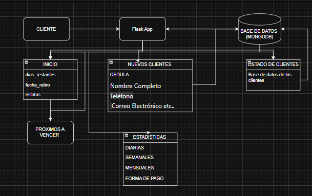
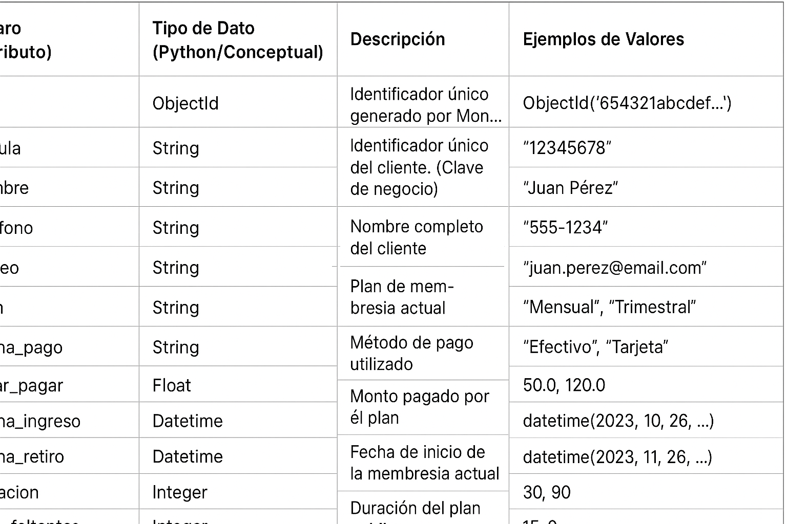

# 🎯 Objetivo

Documentar la arquitectura, instalación, configuración, endpoints, base de datos, seguridad, despliegue y operación técnica del software **SSG (Sistema de Seguridad para Gym)**.

El sistema permite la **gestión de usuarios, membresías, pagos y generación de recibos** en un entorno web para gimnasios, con estadísticas y alertas automáticas sobre vencimientos de planes.

---

# 🏗️ Arquitectura

- **Lenguaje principal:** Python (Flask Framework)
- **Base de datos:** MongoDB
- **Generador de PDFs:** FPDF
- **Entorno de ejecución:** Servidor local o nube 
- **Estructura de capas:**
  - Frontend (HTML, CSS, JS)
  - Backend (Flask API)
  - Base de datos (MongoDB)
  - Generación de archivos (PDFs de recibos)


## Diagramas específicos de Ecommerce

- Componentes principales:



- Flujo de datos completo ( usuario → frontend → api ssg → base de datos → libreria ):

- Diagrama de Secuencias:



- Diagrama de entidades :




| Componente            | Versión mínima  | Descripción                        |
| --------------------- | --------------- | ---------------------------------- |
| **Python**            | 3.10+           | Lenguaje principal                 |
| **Flask**             | 3.0+            | Framework web                      |
| **PyMongo**           | 4.6+            | Conexión a MongoDB                 |
| **FPDF**              | 1.7+            | Generación de recibos en PDF       |
| **MongoDB**           | 6.0+            | Base de datos documental           |
| **Sistema operativo** | Windows / Linux | Entorno de desarrollo y despliegue |


# Instalación

```bash
# Clonar el repositorio
git clone https://github.com/jhefersoncely/ssg-api.git
cd ssg-api

# Crear entorno virtual (opcional pero recomendado)
python -m venv venv
source venv/bin/activate  # En Windows: venv\Scripts\activate

# Instalar dependencias
pip install flask pymongo fpdf

```

# Configuración

```dotenv
FLASK_APP=app.py
FLASK_ENV=development
SECRET_KEY=mi_clave_super_secreta_123
MONGO_URI=mongodb://localhost:27017/gymwork

```

# APIs

| Método                   | Endpoint                                             | Descripción |
| ------------------------ | ---------------------------------------------------- | ----------- |
| `GET /`                  | Página principal con lista de clientes               |             |
| `GET /inicio`            | Panel general del gimnasio                           |             |
| `GET /nuevo_cliente`     | Formulario de registro                               |             |
| `POST /nuevo_cliente`    | Guarda un nuevo cliente                              |             |
| `GET /editar/<cedula>`   | Editar datos del cliente                             |             |
| `POST /editar/<cedula>`  | Actualiza los datos                                  |             |
| `GET /eliminar/<cedula>` | Elimina cliente                                      |             |
| `GET /renovar/<cedula>`  | Formulario de renovación                             |             |
| `POST /renovar/<cedula>` | Renueva membresía                                    |             |
| `GET /proximos_vencer`   | Clientes próximos a vencer                           |             |
| `GET /recibo/<cedula>`   | Genera PDF de recibo                                 |             |
| `GET /estadisticas`      | Muestra estadísticas (diarias, semanales, mensuales) |             |


# Base de Datos

- Estructura de la Base de datos :
```yaml

{
  "cedula": "12345678",
  "nombre": "Juan Pérez",
  "telefono": "3105671234",
  "correo": "juanperez@example.com",
  "forma_pago": "efectivo",
  "valor_pagar": 50000,
  "fecha_ingreso": "2025-11-01",
  "fecha_retiro": "2025-12-01",
  "estado": "Activo"
}
```


# Seguridad

- Clave secreta (SECRET_KEY) para protección de sesiones y mensajes Flash.


# Cumplimiento Legal y Normativo
 
  - Normatividad Colombiana Aplicable
    - 1. Ley 1581 de 2012 
    - 2. Decreto 1377 de 2013

# Observabilidad

- Mensajes flash muestran acciones exitosas o fallidas en el frontend.

- Logs de servidor disponibles en consola Flask.

- Estadísticas de clientes generadas a partir de MongoDB mediante consultas de conteo y fechas.

# Rendimiento

- Uso de índices en MongoDB para consultas rápidas.

- Paginación y filtrado en listados de clientes.

- Generación dinámica de PDF solo bajo demanda (no almacenado en memoria).

# Testing

- Pruebas funcionales locales desde el navegador.

- Validación de rutas /nuevo_cliente, /editar, /renovar.

- Prueba de generación de recibos (/recibo /cedula).

# Despliegue

```yaml
python app.py

version: "3.9"
services:
  api:
    image: ssg-api:latest
    build: .
    ports:
      - "5000:5000"
    environment:
      - MONGO_URI=mongodb://mongo:27017/gymwork
  mongo:
    image: mongo:6
    volumes:
      - ./data:/data/db


```

# Backup y Recuperación

```yaml
// Backup

mongodump --db gymwork --out /backups/gymwork

//Restauracion

mongorestore --db gymwork /backups/gymwork

```


# Cambios y Versionado

- **Cambios Propuestos**

- **En próximas actualizaciones, se planean las siguientes mejoras y cambios estructurales**:

- Rediseño del Front-End:

- Se realizará una renovación completa del entorno visual, optimizando la interfaz para una mejor experiencia de usuario.

- Se aplicará un diseño moderno, adaptable a dispositivos móviles y con un enfoque más intuitivo.

- Se agregara credenciales para diferentes tipos de opciones segun el rol que tengan 

- **Notificaciones Automáticas a Clientes**:

- Se integrará un sistema de mensajería automática que avisará a los clientes cuando su membresía esté próxima a vencer.

- Estas notificaciones podrán ser enviadas por correo electrónico, mensaje de texto o notificación móvil según las preferencias del usuario.

- **Conexión con API del Dispositivo Móvil**:

- Se desarrollará una integración con una API del celular, que permitirá sincronizar datos en tiempo real sobre:

- Progreso físico del cliente por medio de relojes inteligentes (frecuencia cardíaca, calorías, pasos, etc.).

- Días activos en el gimnasio.

- Citas y seguimiento con profesores personalizados.

- Esta conexión permitirá generar estadísticas más precisas y mejorar la personalización de entrenamientos.

- **Sistema de Citas y Agenda Personalizada**:

- Se implementará una nueva función que permitirá a los usuarios agendar citas directamente con los entrenadores disponibles.

- Los entrenadores podrán gestionar sus horarios y confirmar las sesiones desde su panel de control.

- **Control de Versiones**:

- Versión 1.0: Implementación inicial del sistema con módulos de acceso, usuarios, pagos y estadísticas.

- Versión 2.0 (6 meses): Inclusión de la API móvil, rediseño visual del front-end y sistema de notificaciones.

- Versión 2.1 (18 meses): Integración avanzada de seguimiento físico y conexión con dispositivos wearables

- Version 3.0 (2.5 años) Sistema de Afiliaciones y Convenios
  - Gym corporativos
  - Planes empresariales
  - Beneficios por grupos o familiares
  - Facturación masiva y reportes especiales

- Version 3.1 (3 años) Facturación electrónica DIAN
  - Generación automática de facturas
  - Envío por correo
  - Reporte a DIAN

- version 4.0 (3.5 años) Aplicación móvil completa para clientes
  - Reservas de máquinas / clases
  - QR para acceso alternativo
  - Historial de pagos
  - Notificaciones push
  - Suscripción con tarjeta desde el celular

- Versión 4.1 (4.5 años) Aplicación para Entrenadores
  - Rutinas personalizadas desde el celular
  - Estadísticas del cliente
  - Chat interno
  - Evaluación física por fases

- Version 4.2 (5 años )Test de Rendimiento y Evolución Física
  - Pruebas como IMC, RM, FMS
  - Gráficas comparativas por semanas y meses
  - Reportes PDF automáticos